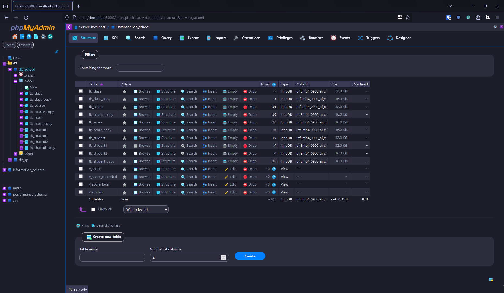

# phpMyAdmin made easy on Windows

> An easy way to start using phpMyAdmin and with beautiful dark theme.


## Screenshots




## Installation

### Download php and phpMyAdmin

Route 1:
---

if you use `scoop`, here's what you do:

```powershell
scoop install php
scoop bucket add apps "https://github.com/kkzzhizhou/scoop-apps"
scoop install phpmyadmin
```
Route 2:
---

Download [php](https://www.php.net/downloads.php) on the official website.
Download [phpmyadmin](https://www.phpmyadmin.net/downloads/) on the official website

### Set up phpMyAdmin

In your home diretory create a `.phpmyadmin` and put the 2 `.ps1` files in it
like so:
```powershell
…\.phpmyadmin
    ├── start-php-server.ps1
    └── stop-php-server.ps1
```

the 2 `.ps1` scripts are pretty simple:

>`start-php-server.ps1`

```powershell
# Start the PHP built-in server from the installation folder
Start-Process "php" -ArgumentList "-S localhost:8000" -WorkingDirectory $ENV:USERPROFILE\scoop\apps\phpmyadmin\current -NoNewWindow

# Wait for the server to start (you may need to adjust this delay)
Start-Sleep -Seconds 1

# Open the URL in the default browser
Start-Process "http://localhost:8000/index.php"
```


>`stop-php-server.ps1`

```powershell
# Get the PHP server process
$phpServerProcess = Get-Process -Name "php" -ErrorAction SilentlyContinue

# Check if the process was found
if ($phpServerProcess) {
    # Stop the PHP server process
    Stop-Process -InputObject $phpServerProcess
    Write-Host "PHP server process has been stopped."
} else {
    Write-Host "PHP server process is not running."
}

```
If you don't install phpmyadmin using scoop like I do, please make sure to change the directory of each `.ps1`
and set it to your phpmyadmin directory. It's just the folder containing the `index.php` file.

Then in your `$profile` add the following:

```powershell
function phpmyadmin {
    param(
        [string]$action
    )

    if ($action -eq "start") {
        # Run the start-php-server.ps1 script
        & "$ENV:USERPROFILE\.phpmyadmin\start-php-server.ps1"
    } elseif ($action -eq "stop") {
        # Run the stop-php-server.ps1 script
        & "$ENV:USERPROFILE\.phpmyadmin\stop-php-server.ps1"
    } else {
        Write-Host "Invalid action. Please use 'start' or 'stop'."
    }
}
```

And reload by `. $profile` or close and reopen powershell.

Now you in your powershell you can enter `phpmyadmin start` to start 
using `phpMyAdmin` and `phpmyadmin stop` (or simply close powershell)

### Overall dark theme

You can download many themes on the [phpmyadmin official website](https://www.phpmyadmin.net/themes/).

My favorite is [blueberry](https://files.phpmyadmin.net/themes/blueberry/1.1.0/blueberry-1.1.0.zip).

It's use the same color palette as TokyoNight, just perfection.

Here's how you apply a theme:

1. Download a theme, decompress the .zip file;
2. copy the all folder of that extracted .zip file to your `../phpmyadmin/themes` folder
3. launch phpmyadmin and choose your new theme there, it will automatically set it as the new default.
